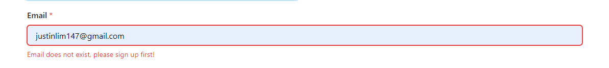
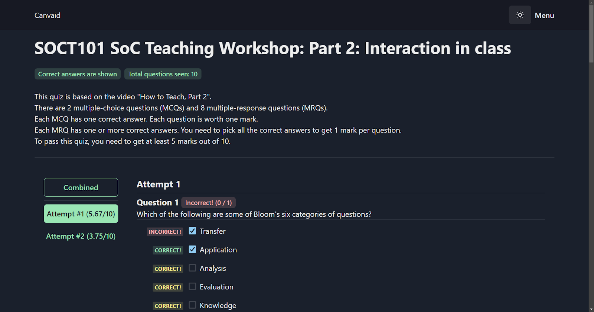

## Team Name

Canvaid

## Proposed Level of Achievement

Apollo

## Aim

We are going to build a quiz website that caters to students who use the Canvas website.

## Motivation

When students do quizzes conducted on Canvas that can be tried multiple times, often it’s difficult to keep track of what options they’ve selected that are wrong. If a student has to do a quiz multiple times (perhaps they have to get full marks, and the questions are rotated from a common pool each time they do it, aka GEA1000), it can be easy to forget which options that they’ve selected that are wrong.

Thus, our idea is to develop a website that will store information about the quizzes that the student has completed. If the questions for a quiz are rotated from a common pool, then the website will update the total list of questions for that quiz whenever the student finishes another quiz attempt.

Additionally, our website will allow students to re-attempt the quizzes after submission so that they can have additional practice for exams or for further understanding.

We hope that this website will be able to help students (us included) in the future, when we are revising for exams.

## Vision

Canvaid should be as **easy to use** as possible. We will strive for a mobile-first design approach, as we believe that catering to mobile users will allow students to study their quizzes even while on the go. Additionally, because it is 2023, Canvaid will also support **dark mode**.

Ultimately, we hope that Canvaid will be a quintessential add-on for any student who uses Canvas as their university’s LMS.

## User Stories

1. As a student attempting quizzes, I want to be able to see which questions I’ve gotten wrong in all my attempts.
2. As a student revising for exams, I want to be able to see all the previous quiz questions together to revise.
3. As a student revising for exams, I want to be able to re-do the quizzes to check my understanding.
4. As a student revising for exams, I want to be able to simulate an exam environment by taking a random permutation of questions from all the questions, along with an inbuilt timer
5. As a student when doing the quizzes, I want to be able to annotate the questions that I’ve gotten wrong to be able to be more aware of the mistakes I made when revising for future exams
6. As a student, I want to be able to flag out the questions that I find to be difficult.
7. As a student, when revising from exams, I want to be able to do my revision on any of my own devices (synchronization across devices)

## Proof of Concept

Website link: [https://canvaid.com](https://canvaid.com)

Login credentials: you can choose to create your own if you would like to try uploading the provided quizzes, or you can use the following:

-   Email: [testaccount@gmail.com](mailto:testaccount@gmail.com)
-   Password: testaccount

Sample files: [https://drive.google.com/drive/folders/1Dv4j_BYedEYJ3uaB1O6HQqg_QgF3N1it?usp=drive_link](https://drive.google.com/drive/folders/1Dv4j_BYedEYJ3uaB1O6HQqg_QgF3N1it?usp=drive_link)

There are 3 files for SOCT101 Quiz 2, and 2 files for SOCT101 Quiz 3.

These files are for demonstration only. You may open them in the browser to see how they look like. Future versions will allow you to upload your own files.

## Site overview

1. Landing page, unauthenticated ([https://canvaid.com](https://canvaid.com))

When new users head to the site, they will see a landing page that will explain to them the purpose of the website. In future versions, the landing page will be made prettier with the inclusion of illustrations, features and an explainer video.

>>>>>  gd2md-html alert: inline image link here (to images/image1.png). Store image on your image server and adjust path/filename/extension if necessary.  (<a href="#">Back to top</a>)(<a href="#gdcalert2">Next alert</a>) >>>>> 

The “Get Started” button will prompt users to sign in, with either an email account, or with their Google accounts.

2. Authentication page ([https://canvaid.com/auth](https://canvaid.com/auth))

Our app uses Firebase Authentication to register accounts. New users have two methods to create an account, either by using their Google account or through an email / password combo. The authentication page presents options for both returning and new users.

#### New Users

>>>>>  gd2md-html alert: inline image link here (to images/image2.png). Store image on your image server and adjust path/filename/extension if necessary.  (<a href="#">Back to top</a>)(<a href="#gdcalert3">Next alert</a>) >>>>> 

New users will click on the tab, and be presented with a form for them to fill in. Helpful tips below each input field hint to them what they must enter in the fields.

Due to Firebase limitations, the password must be at least 6 characters long. We do not check for password strength or email validity at this time.

The signup form also has error states - when input is invalid, the field will be highlighted in red and the Sign up button will be disabled.

>>>>>  gd2md-html alert: inline image link here (to images/image3.png). Store image on your image server and adjust path/filename/extension if necessary.  (<a href="#">Back to top</a>)(<a href="#gdcalert4">Next alert</a>) >>>>> 

There will be another round of field validation on the server side, to ensure that there is no invalid input.

The Sign up with Google button is also present on this tab. This button will automatically create an account for the user if it does not exist yet. Furthermore, there is no need for a password.

#### Existing users

>>>>>  gd2md-html alert: inline image link here (to images/image4.png). Store image on your image server and adjust path/filename/extension if necessary.  (<a href="#">Back to top</a>)(<a href="#gdcalert5">Next alert</a>) >>>>> 

Existing users will be presented with the Returning User screen. They can enter their email and password combination, and we will send it to Firebase for authentication.

Upon an error, the errored field(s) will be highlighted in red. There are 2 possible errors:

1. No registered account with this email
2. Incorrect password

>>>>>  gd2md-html alert: inline image link here (to images/image5.png). Store image on your image server and adjust path/filename/extension if necessary.  (<a href="#">Back to top</a>)(<a href="#gdcalert6">Next alert</a>) >>>>> 

>>>>>  gd2md-html alert: inline image link here (to images/image6.png). Store image on your image server and adjust path/filename/extension if necessary.  (<a href="#">Back to top</a>)(<a href="#gdcalert7">Next alert</a>) >>>>> 

If users choose to sign in with Google, a popup will ask them to choose the Google account that they want to use.

1. Landing page, authenticated ([https://canvaid.com](https://canvaid.com))

Once the user is authenticated, the landing page changes to show a list of quizzes that the user has uploaded, a button to add more uploads, as well as a search function.

[picture]

On this page, there are a few features.

1. Add new quiz
    - Brings the user to the add page (see below)
2. Search for quiz (not implemented)
    - Will allow users to filter by quiz name / course name
3. List of quizzes
    - Quizzes are grouped by the quiz type. For example, all GEA1000 Quiz 1s will be grouped together.
    - The user can choose to delete the entire quiz by clicking the trash can.
    - The user can view the specific quiz by clicking on “View quiz”.
4. Upload a new quiz attempt page

>>>>>  gd2md-html alert: inline image link here (to images/image7.png). Store image on your image server and adjust path/filename/extension if necessary.  (<a href="#">Back to top</a>)(<a href="#gdcalert8">Next alert</a>) >>>>> 

We have streamlined the quiz-adding process. Now, our app is able to automatically determine the course code and quiz name from the uploaded file. Therefore, all the user has to do is to go to the Canvas page that displays the quiz results for the quiz they want to upload, press ctrl + s to save the page as an HTML file, and drag and drop the HTML file in the zone.

Once the user has dropped the file in the zone, uploading will begin automatically. The text in the drag-and-drop box will change to indicate so.

>>>>>  gd2md-html alert: inline image link here (to images/image8.png). Store image on your image server and adjust path/filename/extension if necessary.  (<a href="#">Back to top</a>)(<a href="#gdcalert9">Next alert</a>) >>>>> 

\
Once the quiz has been successfully added and parsed, the user will be redirected to the quiz-specific page for the quiz they just uploaded.

1. Specific quiz page

>>>>>  gd2md-html alert: inline image link here (to images/image9.png). Store image on your image server and adjust path/filename/extension if necessary.  (<a href="#">Back to top</a>)(<a href="#gdcalert10">Next alert</a>) >>>>> 

Once the user has uploaded a quiz attempt, they will see this page. This page will list a few things:

1. The quiz questions
2. The user’s uploaded attempts
3. Their score for each attempt
4. The total number of questions.

For each question, the website will display the options the user selected. \
If the quiz has correct answers enabled (as this quiz does), the options will be labelled as such.

1. Correct and selected → Green correct marker
2. Correct but not selected → Yellow correct marker
3. Incorrect and selected → Red incorrect marker
4. Incorrect and not selected → no marker

If the quiz has no correct answers, the app will try to obtain the correct answers by looking at the score of the question.

1. Score = total score (e.g. 1/1, 5/5) → All options that the user selected are marked as correct
2. Score != total score → Unable to determine correct answers, no labels are shown at all

As the user uploads more attempts, they will appear on the left side. The user can upload more attempts by going to the add page and then simply dragging the file over. The quiz attempt will automatically be added under this quiz.

>>>>>  gd2md-html alert: inline image link here (to images/image10.png). Store image on your image server and adjust path/filename/extension if necessary.  (<a href="#">Back to top</a>)(<a href="#gdcalert11">Next alert</a>) >>>>> 

This is the user’s second attempt.

Users can choose to see all questions with the highest score of all attempts by simply clicking on the Combined button.

For each question, the best attempt will be shown.

This function works with quizzes that take questions from a common pool. \
For example, if a quiz has a pool of 8 questions, with 3 questions chosen randomly per quiz, and attempt #1 has questions 1,4,5, and attempt #2 has questions 2,5,9, the Combined button will display all 5 seen questions, with the best attempt of question 5 shown.

>>>>>  gd2md-html alert: inline image link here (to images/image11.png). Store image on your image server and adjust path/filename/extension if necessary.  (<a href="#">Back to top</a>)(<a href="#gdcalert12">Next alert</a>) >>>>> 

In this example, the best attempt for question 1 was Attempt #2, so Attempt #2 is shown, while the best attempt for question 2 was Attempt #1, so Attempt #1 is shown. In the case of multiple attempts with the same score, the first such attempt is taken.

## Features and implementation

### 1 Dark Mode

Dark mode is important for today’s users, and we fully support dark mode as of Milestone 2, and intend to continue doing so.

>>>>>  gd2md-html alert: inline image link here (to images/image12.png). Store image on your image server and adjust path/filename/extension if necessary.  (<a href="#">Back to top</a>)(<a href="#gdcalert13">Next alert</a>) >>>>> 

Dark mode handling is done through our frontend UI library, Chakra UI. Most Chakra UI components already support Dark Mode, and for our custom components, the use of the `useColorModeValue()` hook helps us achieve dark mode.

### 2 Authentication via Firebase

To abstract the hassle of implementing our own authentication, we made use of the Firebase Authentication API. Email/password and Google providers are supported.

### 3 Processing of uploaded file

We used react-dropzone in order to create the drop area for the file. Then, the file is sent to the backend via a POST request.

In the backend, we use node-html-parser to parse the HTML file, to get 1) answers for each question, 2) the course id, 3) the quiz id. Then, we send a total of 3 API requests to Canvas, using the user’s API token, the course id and the quiz id.

1. GET /courses/:courseId/quizzes/:quizId/submissions
    1. This query gets all the submissions of this specific quiz, given the quiz and courseId. This allows us to get the details of this specific quizAttempt that was uploaded, including the quizSubmissionId which is used in the next query
2. GET /quiz_submissions/:quizSubmissionId/questions 2. This query gets the questions of this specific quiz. We have to use quizSubmissionId because during testing, we found that querying for the quiz questions directly was denied as we did not have enough permissions. This alternative API route provides us the same data.
3. GET /courses/:courseId/quizzes/:quizId 3. This query gets us the quiz details (but no questions). This allows us to automatically determine the course name and quiz name.

With the data above and the HTML file, we can create an object that represents a single quiz attempt.

We check our Firestore database to see if any quizzes with the same quiz ID and user ID have already been uploaded. If so, we add it to the list of attempts of that quiz. If not, the quiz is created.

### 4 Calculating the Best Attempt

An example of the data object stored in Firestore is shown below.

>>>>>  gd2md-html alert: inline image link here (to images/image13.png). Store image on your image server and adjust path/filename/extension if necessary.  (<a href="#">Back to top</a>)(<a href="#gdcalert14">Next alert</a>) >>>>> 

For this, there are two attempts, represented by the length 2 arrays of `selectedOptions` and `submissions`.

To calculate the best score, we run a for loop over the `questions` key, with a local variable called `bestAttempt `in each loop.

There is an inner loop which then loops over each attempt in `selectedOptions`, and looks for the attempt with the highest `your_score `for that question.

This query is O((number of attempts) \* (number of questions)) in runtime complexity, however we do not anticipate this to be an issue.

The frontend then takes the result of this and displays it.

### 5 Annotation of each question

We support adding comments to each question. This allows users to remember why they got a question wrong, or how they arrived at the answer.

>>>>>  gd2md-html alert: inline image link here (to images/image14.png). Store image on your image server and adjust path/filename/extension if necessary.  (<a href="#">Back to top</a>)(<a href="#gdcalert15">Next alert</a>) >>>>> 

Internally, the annotations are implemented as a string array for each question in the questions array. In future, this will be changed to an object array with a string key, to allow more flexibility such as adding the date of comment.

### 6 Flagging of questions (Unimplemented)

We will support flagging questions, similar to how Examplify supports it. This feature will be implemented in Milestone 3.

The flagging of questions will be implemented similarly to the annotations, as a number value in each question in the questions array to allow for more flexibility in future.

0 → unflagged

1 → flagged

2…onwards → space for future codes

### 7 Exam mode (Unimplemented)

We will support “Exam mode”, which can be customized to the user’s needs. There will be two primary modes:

1. Single Quiz mode
2. Course quizzes mode

There will also be some common options that will apply in both modes:

1. Number of questions
2. Time limit
3. Show answers after answering each question

When the user enters Exam mode, all answers are hidden, and the user can re-do the quiz as if it was on Canvas. There will be a visible timer for the student to reference.

**Single Quiz mode**

In this mode, the user can re-do a single quiz. They can choose to redo all or some of the questions. The question and options order will be randomized.

**Course quizzes mode**

In this mode, the user will redo quizzes of a certain course. The app will randomly pick questions from all quizzes that are of the selected course, in a random order and randomize the options order.

Once the user has finished the quiz, the quiz will be “marked” and the results will be shown to the user.

Note: Quiz questions that we do not know the correct answers to will not be chosen to be displayed.

### Testing

In order to thoroughly test our support for the different type of canvas quiz

## Diagrams

### Frontend Flow

>>>>>  gd2md-html alert: inline image link here (to images/image15.png). Store image on your image server and adjust path/filename/extension if necessary.  (<a href="#">Back to top</a>)(<a href="#gdcalert16">Next alert</a>) >>>>> 

### Architecture Diagram

>>>>>  gd2md-html alert: inline image link here (to images/image16.png). Store image on your image server and adjust path/filename/extension if necessary.  (<a href="#">Back to top</a>)(<a href="#gdcalert17">Next alert</a>) >>>>> 

## Timeline

### Milestone 1 (29 May)

We wish to finish the parsing of the quiz data, and finish the uploading and storage system of quizzes. We also want to finish the website skeleton inclusive of adding new modules and adding new quiz categories with a login system (Microsoft login, but Google if not possible).

### Milestone 2 (26 Jun)

We hope to finish the UI design of both the website and the extension and also finish the core structure of the website: uploading quizzes, and new attempts updating which options are right and wrong.

### Milestone 3 (24 Jul)

We want to finish comments on questions, flagging of questions and the ability to re-do the quizzes and also finish testing the website. We also want to explore canvas API to see if it’s feasible to be used instead of the extension and also the ability to support more quiz question formats (e.g. match-the-corresponding-answer, open-ended questions, quiz questions with pictures in them. We also might explore the feasibility of adding an AI chatbot such as Chatgpt 4 to supplement their learning.
